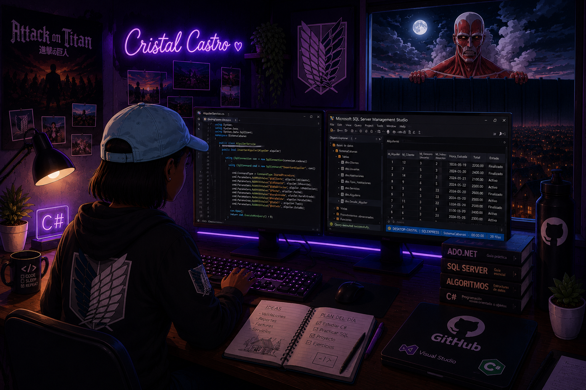

  

# 👋 Hola, mi nombre es Cristal Castro

💻 Estudiante de informática

📍 República Dominicana

Me gusta desarrollar aplicaciones de escritorio en C# y trabajar con bases de datos en SQL Server. En este perfil comparto algunos de los proyectos que he realizado mientras aprendo y sigo mejorando mis habilidades. 

## 🚀 Tecnologías

- C#
- SQL Server
- Windows Forms
- ADO.NET
- HTML
- CSS
- Git y GitHub

## 📂 Proyectos

- 📚 Sistema Escolar
- 📚 Sistema de Biblioteca
- 🏠 Sistema de Cabañas
- 🌐 Páginas web con HTML y CSS

---

	

	

